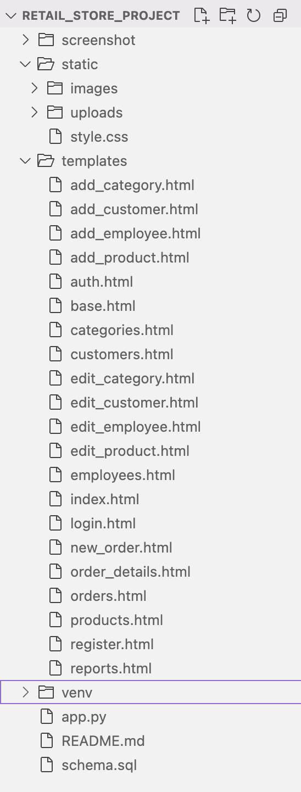
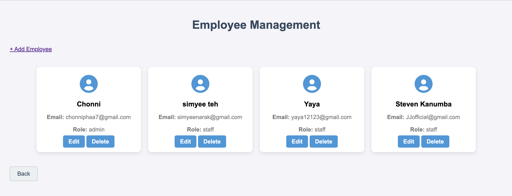

# Retail Store Management System

This is a retail store management system developed using **Flask** and **MySQL**. It allows store owners and staff to manage products, categories, customers, and orders effectively. The project supports adding, editing, and deleting products and categories, managing customers, and handling orders, including stock updates.

---

## Features

- **User Authentication**: Login system.
- **Product Management**: Add, edit, and delete products.
- **Category Management**: Add, edit, and delete product categories.
- **Order Management**: Create and manage orders, update stock, and calculate total sales.
- **Customer Management**: Add, edit, and delete customers.
- **Search Functionality**: Search for products based on name.
- **Admin Control**: Admin role can manage products, categories, customers, and orders.

---

## Requirements

- Python 3.x
- Flask
- MySQL
- Flask-MySQL (or MySQL connector)
- Werkzeug
- Other dependencies listed in `requirements.txt`

---

## Installation

1. **Clone the repository**:
    ```bash
    git clone <repository_url>
    cd retail-store-project
    ```

2. **Create a virtual environment**:
    ```bash
    python3 -m venv venv
    ```

3. **Activate the virtual environment**:
    - On macOS/Linux:
      ```bash
      source venv/bin/activate
      ```
    - On Windows:
      ```bash
      .\venv\Scripts\activate
      ```

4. **Install dependencies**:
    ```bash
    pip install -r requirements.txt
    ```

5. **Set up MySQL database**:
    - Create a new database `retail_db` in MySQL.
    - Use the SQL schema from `schema.sql` to set up the database tables.

6. **Configure the `app.py` file**:
    - Update the database connection details in the `get_db_connection()` function.
    - Update the `UPLOAD_FOLDER` in `app.py` to your desired location if needed.

---

## Usage

1. **Start the Flask server**:
    ```bash
    python app.py
    ```

2. **Access the application**:
    Open your browser and go to `http://127.0.0.1:5006/` to start using the system.

---

## Folder Structure
retail_store_project/
├── app.py
├── config.py
├── schema.sql
├── static/
│ ├── uploads/
│ │ ├── t-shirt.jpg
│ │ ├── socks.jpg
│ │ └── hoodie.jpg
│ └── style.css
├── templates/
│ ├── add_category.html
│ ├── add_product.html
│ ├── products.html
│ └── ...
├── venv/
├── README.md
└── screenshot/



**Admin View**
**Login Page**  


**Home Page**  


**Product Page**  


**Add Product Page**


**Category Page**  


**Product in each Category Page**  


**New Order Page**  


**Customers Page**  


**Employees Page**  


**Add Employee Page**


**Report Page**  
  
  


**Customer view**
**Home Page**
  

**Product Page**
  

**Category Page**
  

**New Order Page**  


